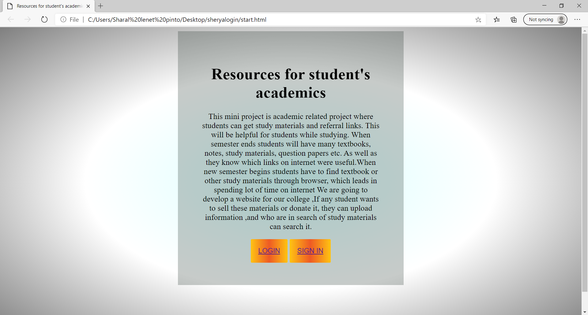
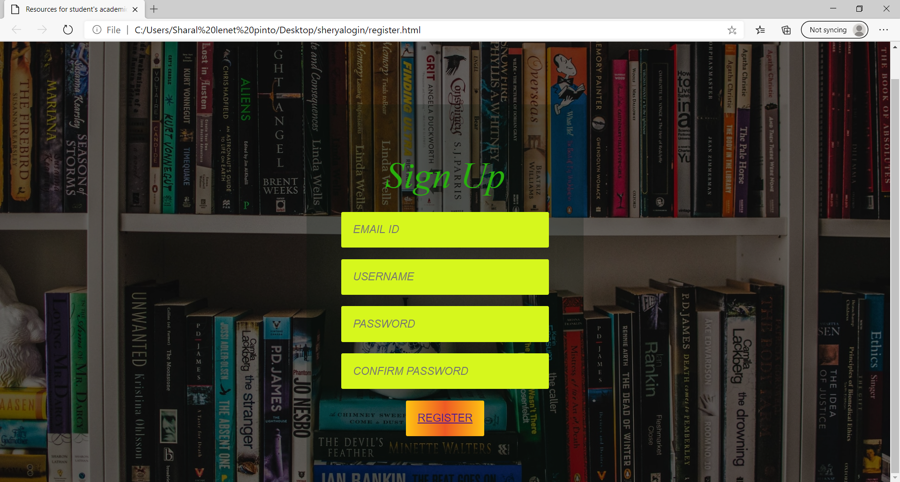
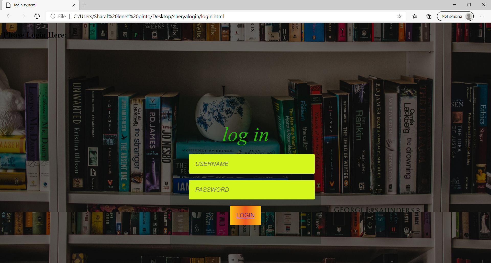

# dbmsminiproject
start pages which gives introduction of web application 
and has 2 buttons login and sign up,when the button is pressed ,the user is taken to respective page

sign in page 
if a user wants to use web application then, user must have an account ,to create account
username,email id, and user has to create a password.

 login page has 2 fields ,user has to enter the username and password 
 if both are correct then they will be taken to the a welcome page 
 
 

